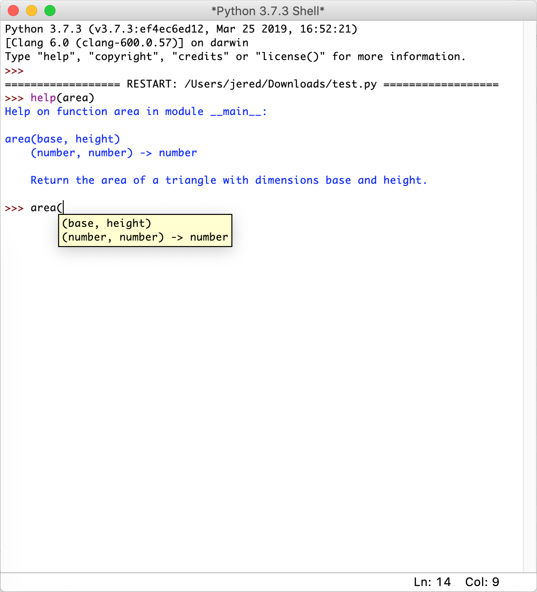

# Part 1: Strings

## Input/Output and `str` Formatting

The `print()` function can take more than one argument and arguments are separated by a comma. After evaluation, the values are separated by a space. You don't need to concatenate the arguments with the `+` operator.

Example:

```python
>>> print('Hello', 'there.')
Hello there.
>>> print("You're", 'a', 'bold', 'one.')
You're a bold one.
>>>
```

The general form for a `return` statement:

> `return expression`

When a `return` statement executes, the expression is evaluated to produce a memory address. 

- *What is passed back to the caller?* The memory address.
- *What is displayed?* Nothing!

Example of a `return` statement:

```python
>>> def square_return(num):
        return num ** 2
>>> answer_return = square_return(4)
>>> answer_return
16
>>> answer_return
16
>>>
```

In the above example, on line 3, the function `square_return` is called and the argument provided is `4`. The function takes the argument and puts 4 to the power 2. This expression results in the value `16`. It is the memory address (that contains `16`) that is assigned to the variable `answer_return`. Nothing is displayed to the user, there was only some calculation done. But when you call `answer_return`, it will show the value that is contained in the memory address. Notice how you can call `answer_return` over and over and that is keeps retaining the value `16`.

The general form for a `print()` statement:

> `print(argument)`

When a `print()` function call is executed, the argument(s) are evaluated to produce memory address(es). This is the same as in the `return` statement.

- *What is passed back to the caller?* Nothing!
- *What is displayed?* The values at those memory address(es) are displayed on screen.

Example of a `print()` statement:

```python
>>> def square_print(num):
        print('The square of num is', num ** 2)
>>> answer_print = square_print(4)
The square of num is 16
>>> answer_print
>>> 
```

In the above example, on line 3, the function `square_print` is called with `4` as provided argument. There is no `return` statement in this function, so what will happen is that the string `The square of num is 16` will be printed once and immediately. If you call `answer_print`, like on line 5, it shows nothing because the function `square_print` has the value `None`. This is caused by the lack of a `return` statement.

> A function that does not have a return statement returns `None`.

## Docstrings and Function Help

Docstrings provide information and help for you functions.

Example:

```python
def area(base, height):
    """(number, number) -> number
    
    Return the area of a triangle with dimensions base and height.
    """
    
    return base * height / 2
```

The built-in help function shows the description of a function. The parameters are shown in IDLE when you type the function name and first parenthesis.



# Part 2: Designing Functions

## Function Design Recipe

...

## Function Reuse

## Visualizing Function Calls